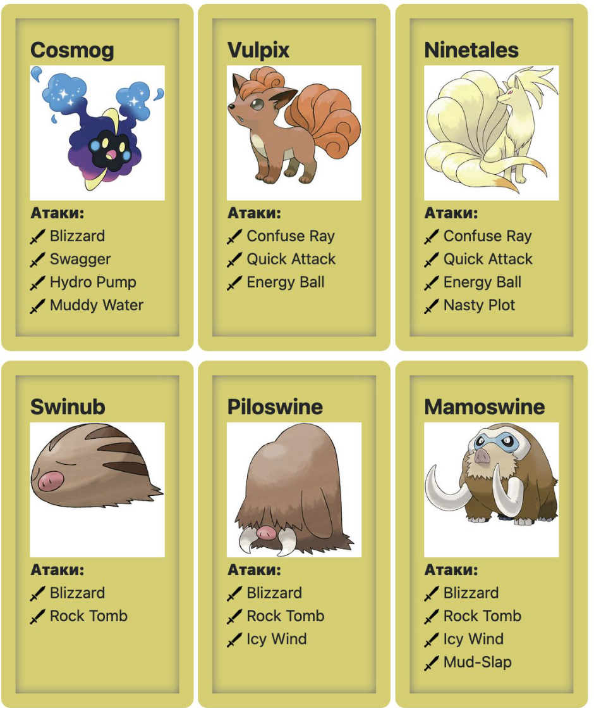

#### Task #22

Вариант 1: взять 17 домашку и для каждого класса из этой домашки написать родительский класс в соответствии с названием подпакета (animal, people, transport).

Вариант 2:
Реализуейте дочерние классы покемонов по этому набору: 

